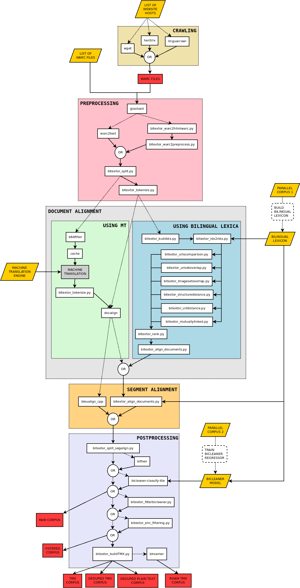

# 


[](https://discord.gg/etYDaZm)
[](https://snakemake.readthedocs.io)

`Bitextor` is a tool to automatically harvest bitexts from multilingual websites. To run it, it is necessary to provide:

1. The source where the parallel data will be searched: one or more websites (namely, Bitextor needs [website hostnames](https://en.wikipedia.org/wiki/URL) or [WARC files](https://iipc.github.io/warc-specifications/specifications/warc-format/warc-1.1/))
2. The two languages on which the user is interested: language IDs must be provided following the [ISO 639-1](https://en.wikipedia.org/wiki/List_of_ISO_639-1_codes)
3. A source of bilingual information between these two languages: either a bilingual lexicon (such as those available at the [bitextor-data repository](https://github.com/bitextor/bitextor-data/releases/tag/bitextor-v1.0)), a machine translation (MT) system, or a parallel corpus to be used to produce either a lexicon or an MT system (depending on the alignment strategy chosen, see below)

## Installation

Bitextor can be installed via Docker, Conda or built from source. See [INSTALL.md](INSTALL.md) for instructions.

## Usage

```text
usage: bitextor [-C FILE [FILE ...]] [-c KEY=VALUE [KEY=VALUE ...]]
                [-j JOBS] [-k] [--notemp] [--dry-run]
                [--forceall] [--forcerun [TARGET [TARGET ...]]]
                [-q] [-h]

launch Bitextor

Bitextor config::
  -C FILE [FILE ...], --configfile FILE [FILE ...]
                        Bitextor YAML configuration file
  -c KEY=VALUE [KEY=VALUE ...], --config KEY=VALUE [KEY=VALUE ...]
                        Set or overwrite values for Bitextor config

Optional arguments::
  -j JOBS, --jobs JOBS  Number of provided cores
  -k, --keep-going      Go on with independent jobs if a job fails
  --notemp              Disable deletion of intermediate files marked as temporary
  --dry-run             Do not execute anything and display what would be done
  --forceall            Force rerun every job
  --forcerun TARGET [TARGET ...]
                        List of files and rules that shall be re-created/re-executed
  -q, --quiet           Do not print job information
  -h, --help            Show this help message and exit
```

## Advanced usage

Bitextor uses [Snakemake](https://snakemake.readthedocs.io/en/stable/index.html) to define Bitextor's workflow and manage its execution. Snakemake provides a lot of flexibility in terms of configuring the execution of the pipeline. For advanced users that want to make the most out of this tool, `bitextor-full` command is provided that calls Snakemake CLI with Bitextor's workflow and exposes all of Snakemake's parameters.

### Execution on a cluster

To run Bitextor on a cluster with a software that allows to manage job queues, it is recommended to use `bitextor-full` command and use [Snakemake's cluster configuration](https://snakemake.readthedocs.io/en/stable/executing/cli.html#profiles).

## Bitextor configuration

Bitextor uses a configuration file to define the variables required by the pipeline. Depending on the options defined in this configuration file the pipeline can behave differently, running alternative tools and functionalities. An exhaustive overview of all the options that can be set in the configuration file and how they affect the pipeline can be found in [CONFIG.md](CONFIG.md).

**Suggestion**: A minimalist [configuration file sample](config/basic.yaml) is provided in this repository. You can take it as an starting point by changing all the paths to match your environment.

## Bitextor output

Bitextor generates the final parallel corpora in multiple formats. These files will be placed in `permanentDir` folder and will have the following format: `{lang1}-{lang2}.{prefix}.gz`, where `{prefix}` corresponds to a descriptor of the corresponding format.

### Default

The files that will be always generated (regardless of configuration) are `{lang1}-{lang2}.raw.gz` and `{lang1}-{lang2}.sent.gz`. These files come in Moses format, i.e. tab-separated columns.

* `{lang1}-{lang2}.raw.gz`: parallel corpus that contains every aligned sentences,this file has **no de-duplication** and the sentences are **not filtered**.

  The columns in this file are `url1 url2 sent1 sent2 aligner_score`, where:

  * `sent1` and `sent2` correspond to the sentence pair in `lang1` and `lang2`
  * `url1` and `url2` correspond to the source documents of the sentences
  * `aligner_score` is the score given to the pair by the sentence aligner (bleualign or hunalign)

  This file comes accompanied by the corresponding statistics file `{lang1}-{lang2}.stats.raw`, which provides information the size of the corpus in MB and in number of  tokens.

* `{lang1}-{lang2}.sent.gz`: parallel corpus after adding **deferred** checksums, running **Bifixer**, filtering using **Bicleaner** with the specified threshold, adding **ELRC** metrics, and **sorted** to have the duplicate or (near-duplicate) sentences together.

    In this case, the columns depend largely on the configuration of Bitextor, so the columns corresponding to the steps that were not enabled will be omitted in this file.

    The possible columns that may appear in this file are (in this order):

  1. default: `url1 url2 sent1 sent2 aligner_score`
  2. deferred: `deferred_checksum1 deferred_checksum2`
      * these fields may be used to reconstruct the original corpus using [Deferred crawling reconstructor](https://github.com/bitextor/deferred-crawling)
  3. bifixer: `bifixer_hash bifixer_score`
      * `bifixer_hash` tags duplicate or near-duplicate sentences
      * `bifixer_score` rates quality of duplicate or near-duplicate sentences
  4. bicleaner: `bicleaner_score`
      * quality score given to the sentence pair by Bicleaner
  5. elrc: `length_ratio num_tokens_src num_tokens_trg`
      * `num_tokens_src` is the number of tokens in source sentence
      * `num_tokens_trg` is the number of tokens in target sentence
      * `length_ratio` is the ratio between the two (source divided by target)

### TMX

* `{lang1}-{lang2}.not-deduped.tmx`

### De-duplication

* `{lang1}-{lang2}.deduped.tmx`
* `{lang1}-{lang2}.deduped.txt`
* `{lang1}-{lang2}.stats.deduped`

### Biroamer

* `{lang1}-{lang2}.deduped-roamed.tmx`
* `{lang1}-{lang2}.not-deduped-roamed.tmx`

## Pipeline description

Bitextor is a pipeline that runs a collection of scripts to produce a parallel corpus from a collection of multilingual websites. The pipeline is divided in five stages:

1. **Crawling**: documents are downloaded from the specified websites
2. **Pre-processing**: downloaded documents are normalized, boilerplates are removed, plain text is extracted, and language is identified
3. **Document alignment**: parallel documents are identified. Two strategies are implemented for this stage:
    * one using bilingual lexica and a collection of features extracted from HTML; a linear regressor combines these resources to produce a score in [0,1], and
    * another using machine translation and a [TF/IDF](https://en.wikipedia.org/wiki/Tf%E2%80%93idf) strategy to score document pairs
4. **Segment alignment**: each pair of documents is processed to identify parallel segments. Again, two strategies are implemented:
    * one using the tool [Hunalign](http://mokk.bme.hu/resources/hunalign/), and
    * another using [Bleualign](https://github.com/rsennrich/Bleualign), that can only be used if the MT-based-document-alignment strategy is used (machine translations are used for both methods)
5. **Post-processing**: final steps that allow to clean the parallel corpus obtained using the tool [Bicleaner](https://github.com/bitextor/bicleaner), deduplicates translation units, and computes additional quality metrics

The following diagram shows the structure of the pipeline and the different scripts that are used in each stage:




All documents and software contained in this repository reflect only the authors' view. The Innovation and Networks Executive Agency of the European Union is not responsible for any use that may be made of the information it contains.
